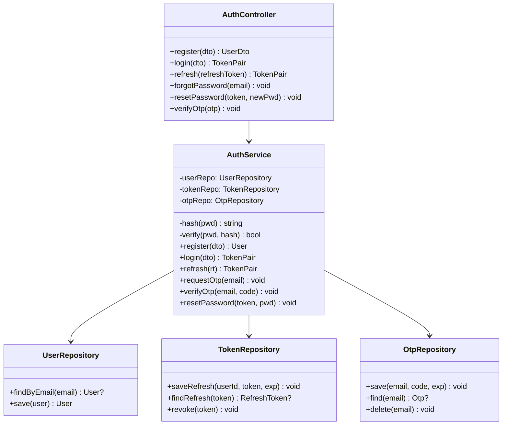
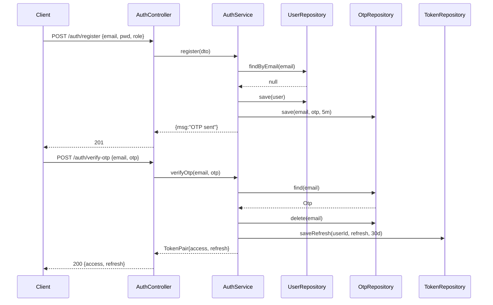

# Low‑Level Design (LLD) – Auth Service

```mermaid
classDiagram
    class AuthController {
        +register(dto) UserDto
        +login(dto) TokenPair
        +refresh(refreshToken) TokenPair
        +forgotPassword(email) void
        +resetPassword(token, newPwd) void
        +verifyOtp(otp) void
    }
    class AuthService {
        -userRepo: UserRepository
        -tokenRepo: TokenRepository
        -otpRepo: OtpRepository
        -hash(pwd) string
        -verify(pwd, hash) bool
        +register(dto) User
        +login(dto) TokenPair
        +refresh(rt) TokenPair
        +requestOtp(email) void
        +verifyOtp(email, code) void
        +resetPassword(token, pwd) void
    }
    class UserRepository {
        +findByEmail(email) User?
        +save(user) User
    }
    class TokenRepository {
        +saveRefresh(userId, token, exp) void
        +findRefresh(token) RefreshToken?
        +revoke(token) void
    }
    class OtpRepository {
        +save(email, code, exp) void
        +find(email) Otp?
        +delete(email) void
    }

    AuthController --> AuthService
    AuthService --> UserRepository
    AuthService --> TokenRepository
    AuthService --> OtpRepository
```

## Sequence – Register → OTP → JWT

```mermaid
sequenceDiagram
    participant C as Client
    participant A as AuthController
    participant S as AuthService
    participant U as UserRepository
    participant O as OtpRepository
    participant T as TokenRepository
    C->>A: POST /auth/register {email, pwd, role}
    A->>S: register(dto)
    S->>U: findByEmail(email)
    U-->>S: null
    S->>U: save(user)
    S->>O: save(email, otp, 5m)
    S-->>A: {msg:"OTP sent"}
    A-->>C: 201
    C->>A: POST /auth/verify-otp {email, otp}
    A->>S: verifyOtp(email, otp)
    S->>O: find(email)
    O-->>S: Otp
    S->>O: delete(email)
    S->>T: saveRefresh(userId, refresh, 30d)
    S-->>A: TokenPair{access, refresh}
    A-->>C: 200 {access, refresh}
```