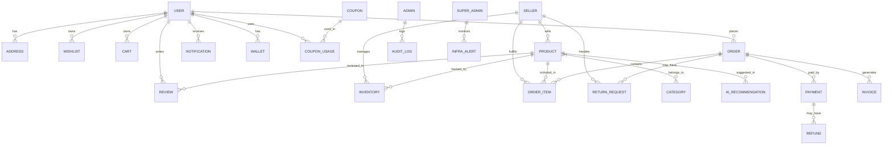

# ER Diagram (Mermaid)



## Prisma Schema (PostgreSQL)

```prisma
// prisma/schema.prisma
generator client {
  provider = "prisma-client-js"
}

datasource db {
  provider = "postgresql"
  url      = env("DATABASE_URL")
}

// ---------- ENUMS ----------
enum Role {
  CUSTOMER
  SELLER
  ADMIN
  SUPER_ADMIN
}

enum OrderStatus {
  PENDING
  CONFIRMED
  PROCESSING
  SHIPPED
  DELIVERED
  CANCELLED
  RETURNED
}

enum PaymentStatus {
  INITIATED
  SUCCESS
  FAILED
  REFUNDED
}

// ---------- MODELS ----------
model User {
  id            String    @id @default(cuid())
  email         String    @unique
  passwordHash  String
  role          Role      @default(CUSTOMER)
  firstName     String
  lastName      String
  phone         String?
  avatarUrl     String?
  isVerified    Boolean   @default(false)
  createdAt     DateTime  @default(now())
  updatedAt     DateTime  @updatedAt
  addresses     Address[]
  wishlist      Wishlist?
  cart          Cart?
  orders        Order[]
  reviews       Review[]
  notifications Notification[]
  wallet        Wallet?
  couponUsages  CouponUsage[]
  @@index([email])
}

model Seller {
  id            String    @id @default(cuid())
  userId        String    @unique
  user          User      @relation(fields: [userId], references: [id], onDelete: Cascade)
  storeName     String
  gstin         String?
  bankAccount   Json?     // encrypted
  kycStatus     Boolean   @default(false)
  createdAt     DateTime  @default(now())
  updatedAt     DateTime  @updatedAt
  products      Product[]
  inventories   Inventory[]
  orderItems    OrderItem[]
  returns       ReturnRequest[]
}

model Admin {
  id        String   @id @default(cuid())
  userId    String   @unique
  user      User     @relation(fields: [userId], references: [id], onDelete: Cascade)
  level     Int      @default(1) // 1=admin, 2=super
  createdAt DateTime @default(now())
  auditLogs AuditLog[]
}

model Address {
  id        String  @id @default(cuid())
  userId    String
  user      User    @relation(fields: [userId], references: [id], onDelete: Cascade)
  label     String  // home, office
  line1     String
  line2     String?
  city      String
  state     String
  postal    String
  country   String  @default("IN")
  isDefault Boolean @default(false)
  @@index([userId])
}

model Category {
  id          String    @id @default(cuid())
  name        String    @unique
  slug        String    @unique
  description String?
  parentId    String?
  parent      Category? @relation("CategoryHierarchy", fields: [parentId], references: [id])
  children    Category[] @relation("CategoryHierarchy")
  products    Product[]
  createdAt   DateTime  @default(now())
  @@index([slug])
}

model Product {
  id          String   @id @default(cuid())
  sellerId    String
  seller      Seller   @relation(fields: [sellerId], references: [id], onDelete: Cascade)
  categoryId  String
  category    Category @relation(fields: [categoryId], references: [id])
  title       String
  slug        String   @unique
  description String
  price       Decimal  @db.Decimal(12,2)
  mrp         Decimal? @db.Decimal(12,2)
  images      String[] // S3 keys
  tags        String[]
  isActive    Boolean  @default(true)
  createdAt   DateTime @default(now())
  updatedAt   DateTime @updatedAt
  inventory   Inventory?
  orderItems  OrderItem[]
  reviews     Review[]
  aiRecs      AIRecommendation[]
  @@index([sellerId])
  @@index([categoryId])
  @@index([slug])
}

model Inventory {
  id        String   @id @default(cuid())
  productId String   @unique
  product   Product  @relation(fields: [productId], references: [id], onDelete: Cascade)
  sellerId  String
  seller    Seller   @relation(fields: [sellerId], references: [id], onDelete: Cascade)
  quantity  Int      @default(0)
  reserved  Int      @default(0)
  lowStockThreshold Int @default(5)
  updatedAt DateTime @updatedAt
  @@index([sellerId])
}

model Cart {
  id        String     @id @default(cuid())
  userId    String     @unique
  user      User       @relation(fields: [userId], references: [id], onDelete: Cascade)
  items     CartItem[]
  updatedAt DateTime   @updatedAt
}

model CartItem {
  id        String  @id @default(cuid())
  cartId    String
  cart      Cart    @relation(fields: [cartId], references: [id], onDelete: Cascade)
  productId String
  quantity  Int     @default(1)
  @@unique([cartId, productId])
}

model Wishlist {
  id        String        @id @default(cuid())
  userId    String        @unique
  user      User          @relation(fields: [userId], references: [id], onDelete: Cascade)
  items     WishlistItem[]
  updatedAt DateTime      @updatedAt
}

model WishlistItem {
  id         String  @id @default(cuid())
  wishlistId String
  wishlist   Wishlist @relation(fields: [wishlistId], references: [id], onDelete: Cascade)
  productId  String
  @@unique([wishlistId, productId])
}

model Order {
  id              String       @id @default(cuid())
  userId          String
  user            User         @relation(fields: [userId], references: [id])
  status          OrderStatus  @default(PENDING)
  subtotal        Decimal      @db.Decimal(12,2)
  tax             Decimal      @db.Decimal(12,2)
  shipping        Decimal      @db.Decimal(12,2)
  discount        Decimal      @db.Decimal(12,2) @default(0)
  total           Decimal      @db.Decimal(12,2)
  couponId        String?
  coupon          Coupon?      @relation(fields: [couponId], references: [id])
  shippingAddress Json        // snapshot
  billingAddress  Json
  items           OrderItem[]
  payment         Payment?
  invoice         Invoice?
  returns         ReturnRequest[]
  createdAt       DateTime     @default(now())
  updatedAt       DateTime     @updatedAt
  @@index([userId])
  @@index([status])
}

model OrderItem {
  id        String   @id @default(cuid())
  orderId   String
  order     Order    @relation(fields: [orderId], references: [id], onDelete: Cascade)
  productId String
  sellerId  String
  seller    Seller   @relation(fields: [sellerId], references: [id])
  title     String
  price     Decimal  @db.Decimal(12,2)
  quantity  Int
  discount  Decimal  @db.Decimal(12,2) @default(0)
  @@index([orderId])
  @@index([sellerId])
}

model Payment {
  id            String        @id @default(cuid())
  orderId       String        @unique
  order         Order         @relation(fields: [orderId], references: [id], onDelete: Cascade)
  provider      String        // razorpay, stripe, upi
  providerRef   String        // payment_id
  amount        Decimal       @db.Decimal(12,2)
  currency      String        @default("INR")
  status        PaymentStatus @default(INITIATED)
  rawResponse   Json?
  refund        Refund?
  createdAt     DateTime      @default(now())
  updatedAt     DateTime      @updatedAt
  @@index([providerRef])
}

model Refund {
  id          String   @id @default(cuid())
  paymentId   String   @unique
  payment     Payment  @relation(fields: [paymentId], references: [id], onDelete: Cascade)
  amount      Decimal  @db.Decimal(12,2)
  reason      String
  status      String   @default("PENDING") // PENDING, PROCESSED, FAILED
  createdAt   DateTime @default(now())
  processedAt DateTime?
}

model Coupon {
  id          String   @id @default(cuid())
  code        String   @unique
  description String
  type        String   // PERCENT, FLAT
  value       Decimal  @db.Decimal(10,2)
  minOrder    Decimal? @db.Decimal(12,2)
  maxDiscount Decimal? @db.Decimal(12,2)
  startAt     DateTime
  endAt       DateTime
  usageLimit  Int      @default(1)
  usedCount   Int      @default(0)
  isActive    Boolean  @default(true)
  usages      CouponUsage[]
}

model CouponUsage {
  id        String  @id @default(cuid())
  couponId  String
  coupon    Coupon  @relation(fields: [couponId], references: [id])
  userId    String
  user      User    @relation(fields: [userId], references: [id])
  orderId   String?
  createdAt DateTime @default(now())
  @@unique([couponId, userId])
}

model Review {
  id        String   @id @default(cuid())
  userId    String
  user      User     @relation(fields: [userId], references: [id])
  productId String
  product   Product  @relation(fields: [productId], references: [id])
  rating    Int      // 1-5
  title     String?
  body      String?
  images    String[] // S3 keys
  isVerifiedPurchase Boolean @default(false)
  createdAt DateTime @default(now())
  @@index([productId])
  @@index([userId])
}

model Notification {
  id        String   @id @default(cuid())
  userId    String
  user      User     @relation(fields: [userId], references: [id], onDelete: Cascade)
  type      String   // ORDER, PROMO, SYSTEM
  title     String
  body      String
  data      Json?
  read      Boolean  @default(false)
  createdAt DateTime @default(now())
  @@index([userId, read])
}

model Wallet {
  id        String   @id @default(cuid())
  userId    String   @unique
  user      User     @relation(fields: [userId], references: [id], onDelete: Cascade)
  balance   Decimal  @db.Decimal(12,2) @default(0)
  updatedAt DateTime @updatedAt
  transactions WalletTxn[]
}

model WalletTxn {
  id          String   @id @default(cuid())
  walletId    String
  wallet      Wallet   @relation(fields: [walletId], references: [id], onDelete: Cascade)
  type        String   // CREDIT, DEBIT
  amount      Decimal  @db.Decimal(12,2)
  description String
  reference   String?  // orderId, refundId
  createdAt   DateTime @default(now())
  @@index([walletId])
}

model Invoice {
  id        String   @id @default(cuid())
  orderId   String   @unique
  order     Order    @relation(fields: [orderId], references: [id], onDelete: Cascade)
  pdfKey    String   // S3 key
  number    String   @unique // INV-YYYYMMDD-XXXX
  createdAt DateTime @default(now())
}

model ReturnRequest {
  id        String   @id @default(cuid())
  orderId   String
  order     Order    @relation(fields: [orderId], references: [id])
  sellerId  String
  seller    Seller   @relation(fields: [sellerId], references: [id])
  userId    String
  reason    String
  status    String   @default("PENDING") // PENDING, APPROVED, REJECTED, COMPLETED
  createdAt DateTime @default(now())
  updatedAt DateTime @updatedAt
  @@index([sellerId])
  @@index([userId])
}

model AIRecommendation {
  id        String   @id @default(cuid())
  productId String
  product   Product  @relation(fields: [productId], references: [id])
  userId    String?
  type      String   // PERSONALIZED, TRENDING, SIMILAR
  score     Float
  createdAt DateTime @default(now())
  @@index([productId])
  @@index([userId])
}

model AuditLog {
  id        String   @id @default(cuid())
  adminId   String
  admin     Admin    @relation(fields: [adminId], references: [id])
  action    String
  entity    String
  entityId  String
  meta      Json?
  createdAt DateTime @default(now())
  @@index([adminId])
  @@index([entity, entityId])
}

model InfraAlert {
  id        String   @id @default(cuid())
  superAdminId String
  superAdmin SuperAdmin @relation(fields: [superAdminId], references: [id])
  source    String   // K8S, JENKINS, DB, AWS
  severity  String   // INFO, WARN, CRITICAL
  message   String
  acknowledged Boolean @default(false)
  createdAt DateTime @default(now())
  @@index([source, severity])
}

model SuperAdmin {
  id        String   @id @default(cuid())
  userId    String   @unique
  user      User     @relation(fields: [userId], references: [id], onDelete: Cascade)
  alerts    InfraAlert[]
}
```